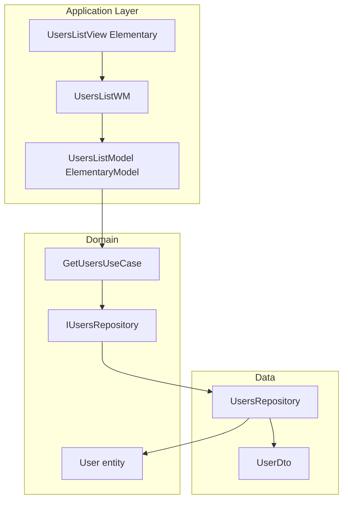

# Enterprise Flutter boilerplate + users list (fake API)

## Current state

- **Docs** in `[catalog/docs](catalog/docs)` define: Clean Architecture (Application / Domain / Data), Elementary-based MVVM (`[application-layer-architecture.md](catalog/docs/Architecture/application-layer-architecture.md)`), `ApiTask` / `fpdart` use cases (`[usecase-guideline.md](catalog/docs/Guidelines/usecase-guideline.md)`), **repository** implementations that own HTTP + DTOs (`[repository-guideline.md](catalog/docs/Guidelines/repository-guideline.md)`, `[data-layer-architecture.md](catalog/docs/Architecture/data-layer-architecture.md)`), Get It + Injectable DI (`[dependency-injection.md](catalog/docs/Guidelines/dependency-injection.md)`), optional endpoints pattern (`[endpoints.md](catalog/docs/Guidelines/endpoints.md)`).
- **Code**: There is **no** `lib/` tree yet—only documentation and `[pubspec.yaml](pubspec.yaml)`.
- **Legacy pubspec**: Hundreds of unrelated dependencies and asset entries (e.g. `oculus` package paths). **Do not carry this forward**—see **Phase 0** below.
- `**catalog/docs`**: Contains guides beyond minimal boilerplate (e.g. event bus, Peacock runbook). **Prune before** linking README and Phase E to docs—see **Phase 0.3**.

## Review workflow (small steps)

**Rule**: Each implementation batch should touch **at most 5 files** (excluding generated `*.g.dart` / `*.config.dart` if you count those separately—prefer committing codegen in the same batch as its source, still keeping the **human-authored** diff small).

- After **each logical slice** (within a phase or todo), **pause for your review**: run `flutter analyze`, `flutter test` as applicable, then merge or approve before the next slice.
- **Split large todos** into multiple PRs/commits—for example Phase 0 might be: (1) minimal `pubspec.yaml` + `analysis_options.yaml`, (2) trim `make/` + root `makefile`, (3) delete/trim `catalog/docs` per 0.3, (4) README only, rather than one giant commit.
- If a single feature needs more than five new files, add **stub/barrel files in an earlier slice** or split by layer (domain files first, then data, then presentation) so each step stays reviewable.
- **CI (Phase F)** can be its own one-file-first commit (workflow only), then README badge in a second commit—still ≤5 files each.

This keeps the plan aligned with **short, checkable diffs**, not one monolithic change per phase.

## Phase 0 — Pre-start (must happen before implementation)

**Goal**: A lean boilerplate repo that only declares what the architecture + first feature need, and tooling that matches a single app package (no monorepo/melos assumptions until you add them back on purpose).

### 0.1 Replace `[pubspec.yaml](pubspec.yaml)` with a minimal dependency set

- **Remove** the existing long dependency and asset lists entirely.
- **Keep only** what v1 requires, for example (exact versions pinned during implementation):
  - **SDK / Flutter**: `flutter` SDK.
  - **UI / MVVM**: `elementary` (and `elementary_helper` if used by views).
  - **HTTP**: `dio`; optional `pretty_dio_logger` as **dev_dependency** or guarded debug-only.
  - **Functional**: `fpdart`.
  - **DI**: `get_it`, `injectable`, `injectable_generator` (**dev**).
  - **Serialization**: `json_annotation`, `json_serializable` (**dev**), `build_runner` (**dev**).
  - **Routing (optional v1)**: `auto_route`, `auto_route_generator` (**dev**)—or defer and use `MaterialApp` + one home route.
  - **Testing**: `flutter_test`, `mocktail` (and `bloc_test` only if you add bloc later).
- **Do not add** connectivity, Hive, Firebase, push, chat, Huawei, etc., until a feature doc requires them.
- **Package `name:`**: valid snake_case (e.g. `flutter_clean_boilerplate`).
- `**flutter.assets` / `fonts**`: minimal set (e.g. empty or one placeholder) so `flutter pub get` and builds work without missing paths.

### 0.2 Trim Makefile and `make/` includes

- **Remove or replace** the current root `[makefile](makefile)` pattern that pulls in `[make/android.mk](make/android.mk)`, `[make/ios.mk](make/ios.mk)`, etc., if those targets are not part of this boilerplate’s story.
- **Remove** melos-driven targets from the boilerplate unless the repo is explicitly a **melos monorepo** again (for v1: **single package**, no melos).
- **Keep** a small set of optional convenience targets only, for example:
  - `make get` → `flutter pub get`
  - `make analyze` → `dart analyze` or `flutter analyze`
  - `make build` / `make watch` → `dart run build_runner build` / `watch` (if code gen is used)
  - `make test` → `flutter test`
- Delete unused files under `[make/](make/)` that only served the old app (or collapse to one `make/flutter.mk` with the above).
- Update `[README.md](README.md)` commands section to match whatever remains.

### 0.3 Remove unused / extra docs under `[catalog/docs](catalog/docs)` (before `lib/` work)

**Goal**: Only keep documentation that matches the **minimal boilerplate** (Clean Architecture, Elementary, repository-only data, DI, optional endpoints/Dio errors). Do this in **≤5-file batches** with review between batches.

**Delete** (default list—adjust if you want to keep as reference):

- `[catalog/docs/Architecture/event-bus.md](catalog/docs/Architecture/event-bus.md)` — out of scope for v1 ([Out of scope](#out-of-scope-for-v1)).
- `[catalog/docs/Architecture/event-system.md](catalog/docs/Architecture/event-system.md)` — same.
- `[catalog/docs/Guidelines/bloc.md](catalog/docs/Guidelines/bloc.md)` — v1 uses Elementary MVVM only; restore when BLoC is added.
- `[catalog/docs/runbook.md](catalog/docs/runbook.md)` — Peacock Makefile runbook; obsolete after 0.2.

**Resolve overlap** (pick one canonical doc per topic; delete or heavily shorten the other):

- `[catalog/docs/Structure/app-layer.md](catalog/docs/Structure/app-layer.md)` vs `[folder-structure.md](catalog/docs/folder-structure.md)` + `[application-layer-architecture.md](catalog/docs/Architecture/application-layer-architecture.md)`.
- `[catalog/docs/Guidelines/widget-model.md](catalog/docs/Guidelines/widget-model.md)` vs `[application-layer-architecture.md](catalog/docs/Architecture/application-layer-architecture.md)`.

**Trim inside remaining files**: remove deprecated Peacock-only sections, stale `comfortech_app` / sample package names in snippets, duplicate footers, and broken links.

**Optional**: add `[catalog/README.md](catalog/README.md)` listing the surviving docs in reading order.

**After Phase 0 (0.1–0.3)**, run `flutter pub get` and ensure analysis passes on an empty or stub `lib/` before starting Phase A feature work.

## Target architecture (aligned with docs)

- **Fake API**: [JSONPlaceholder users](https://jsonplaceholder.typicode.com/users) (`GET /users`).
- **Presentation**: Elementary + `EntityStateNotifier` (`[implementation-example.md](catalog/docs/Architecture/implementation-example.md)`).
- **Domain**: `User` entity; `IUsersRepository` with `ApiTask<List<User>>`; `GetUsersUseCase`.
- **Data**: `UserDto`; `**UsersRepository`** uses injected `Dio` (and optional endpoints), parses JSON → DTO → entity, returns `ApiTask` / domain failures—**no separate datasource class** (`[repository-guideline.md](catalog/docs/Guidelines/repository-guideline.md)`).

## Minimal dependency mapping (after Phase 0)

| Concern    | Packages (illustrative—finalize in pubspec during execution)       |
| ---------- | ------------------------------------------------------------------ |
| UI + MVVM  | `elementary`, `elementary_helper` (if needed)                      |
| HTTP       | `dio`                                                              |
| Functional | `fpdart`                                                           |
| DI         | `get_it`, `injectable`, `injectable_generator` (dev)               |
| Code gen   | `build_runner` (dev), `json_serializable` (dev), `json_annotation` |
| Routing    | `auto_route` + generator (dev)—optional v1                         |

## Suggested folder layout

- `[lib/bootstrap/](lib/bootstrap/)` — entry, DI setup, base URL for JSONPlaceholder.
- `[lib/core/](lib/core/)` — `UseCase`, `ApiTask`, `Failure`, `Dio` registration, optional `Endpoints` base.
- `[lib/features/users/](lib/features/users/)` — `domain/` (entities, `IUsersRepository`, use cases, failures), `data/` (`dtos/`, `repositories/` only—**no `datasources/`**), `presentation/` (pages, models, wms).

## Roadmap (after Phase 0 completes 0.1–0.3)

Apply the **Review workflow** above: split each phase into commits/PRs of **≤5 files** where possible; review before continuing.

### Phase A — Project shell (runnable)

1. Minimal `lib/main.dart`, `MaterialApp`, theme.
2. Register `Dio` with baseUrl `https://jsonplaceholder.typicode.com`, timeouts, optional debug logger.

*Example split*: `main.dart` + theme/widget in ≤5 files; Dio registration in a follow-up small commit if needed.

### Phase B — Core domain + data slice

1. `User` entity and failures.
2. `UserDto` + `UsersRepository` (fetch + map); `GetUsersUseCase`.

*Example split*: domain-only files first (entity, `IUsersRepository`, failures); then DTO + repository; then use case—each batch ≤5 files.

### Phase C — Application layer (Elementary)

1. `UsersListModel`, `UsersListWM`, `UsersListView` (loading / error / list).

*Example split*: model + WM interface; then view + WM impl; or one screen file at a time if file count allows.

### Phase D — DI + navigation

1. Injectable/GetIt: `Dio` → `IUsersRepository` → use case → model; optional AutoRoute.

*Example split*: `injection_container` + module annotations; generated file in same PR; wire `main` in ≤5-file batches.

### Phase E — Quality

1. Unit tests: repository (mock `Dio` / adapter), use case (mock repository)—**one test file per commit** if that keeps batches small.
2. **Complete `[README.md](README.md)`** (root) — treat as the project front page; can be split across ≤5-file commits (e.g. skeleton + TOC first, then sections).
  - **Table of contents**: markdown anchor list at the top linking to all major sections below.
  - **Technologies**: table or bullet list of the **stack** used in this boilerplate (e.g. Flutter/Dart SDK, Elementary, Dio, fpdart, Get It + Injectable, json_serializable/build_runner, optional AutoRoute)—one short line each on **what it is for** in this repo.
  - **Architecture**: links to important articles under `[catalog/docs/Architecture/](catalog/docs/Architecture/)` (at minimum: general, domain, data, application layers; `[implementation-example.md](catalog/docs/Architecture/implementation-example.md)` for the vertical-slice pattern). Adjust list after **Phase 0.3** so every link exists.
  - **Guidelines**: links to key docs under `[catalog/docs/Guidelines/](catalog/docs/Guidelines/)` that the code follows (e.g. repository, dependency injection, use case, endpoints, model/widget-model if retained). Same rule: only link files that remain post-cleanup.
  - **Quick start**: prerequisites, `flutter pub get`, how to run the app, how to run tests/analyze.
  - **Sample feature**: users list + JSONPlaceholder (endpoint, what the screen demonstrates).
  - **Makefile** (if present): common targets in one place.
  - Leave a **CI** subsection heading (or stub bullet in TOC) to be completed in Phase F, or add CI in Phase F and **update TOC** in the same batch.

### Phase F — CI (GitHub Actions)

**Goal**: Every push and pull request runs automated checks so the boilerplate stays green.

1. Add `[.github/workflows/](.github/workflows/)` (e.g. `ci.yaml` or `flutter_ci.yaml`).
2. Use a maintained Flutter setup (e.g. [subosito/flutter-action](https://github.com/subosito/flutter-action) or official patterns) with a **pinned Flutter/SDK channel** matching `pubspec.yaml` `environment.sdk`.
3. **Jobs** (typical minimal set):
  - `flutter pub get`
  - `dart run build_runner build --delete-conflicting-outputs` **if** the repo requires generated files in CI (otherwise commit generated code or document skipping); many teams run codegen in CI to verify it succeeds.
  - `flutter analyze` (or `dart analyze`)
  - `flutter test`
4. Optional: `dart format --output=none --set-exit-if-changed .` on a formatting gate.
5. Trigger on `push` and `pull_request` to default branch (adjust branches as needed).
6. Extend **README**: **CI** section (what runs on push/PR, link to workflow file), optional status badge, and **add CI to the table of contents** from Phase E so the README stays a single coherent document.

**Note**: Full `flutter build apk` / iOS in CI is optional for v1 and adds signing complexity; start with analyze + test unless you explicitly need release artifacts in CI.

## Out of scope for v1

- Event bus, Hive, Firebase, localization `make locale`, full `EndpointsProvider`, melos monorepo—add when needed.

## Success criteria

- Lean **pubspec** and **Makefile** suitable for a starter repo.
- `**[catalog/docs](catalog/docs)`** contains no orphan Peacock-only guides for features out of v1 scope (or they are explicitly deferred in README); **README Architecture/Guidelines links** match surviving files after 0.3.
- `**[README.md](README.md)`** is complete: **table of contents**, **technologies**, **links** to Architecture + Guidelines articles, quick start, sample feature, Makefile/CI as applicable.
- App loads users, shows loading/error/list states.
- Data access is **repository-only** (merged datasource model per docs).
- DI and HTTP are testable (mock `Dio` or HTTP adapter).
- **GitHub Actions** runs analyze (and tests) on each PR/push; README documents CI behavior.
- Work landed in **small reviewable batches** (target **≤5 files** per step, with review between phases/todos).

